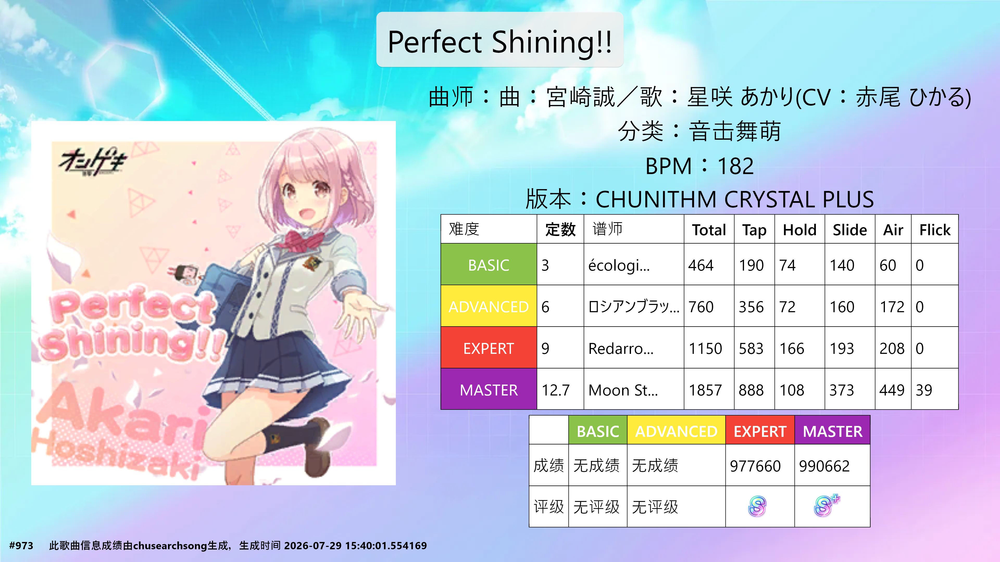

---
prev:
  text: '搜索歌曲'
  link: '/helper/function/search/'
next:
  text: '收藏'
  link: '/helper/function/favorite/'
---

# 歌曲详情页

## 信息显示
歌曲详情页会显示以下信息：
- 曲绘
- 歌曲基本信息
  - 落雪id
  - 分类
  - 版本
  - BPM
  - 趋势
- 其余信息
  - 所属地图
  - 是否需要解锁
  - 谱面属性（世界末日
  - 星级（世界末日
- 别名
- 成绩详情（需配置落雪token
  - 分数
  - Rating
  - over_power
  - 通关状态
  - 全连状态
  - full_chain状态
  - 评级
- 谱面信息
  - 谱师
  - 定数
  - 音符总数量
  - 各个音符的数量
## 页面可见操作
### 收藏
点击右上角的爱心可以进行收藏，已收藏的再点一下可以取消收藏
### 分享成绩
点击右上角的分享按钮（收藏按钮左边）可以进行分享成绩，图片是本地生成的  
效果预览：

> [!NOTE]
> 2026-7-19 已更新渲染方式，感谢[@ChiffonOwO](https://github.com/ChiffonOwO/ChiffonMai)提供的方案

## 页面隐藏操作
### 歌曲试听
进入方式：长按曲绘即可进入试听歌曲界面（图片加载失败也可以  
### 复制文字
- 长按最上面的标题可以复制曲名
- 长按曲师可以复制曲师
- 长按谱师可以复制谱师
- 长按别名可以复制别名
### 进入容错计算
长按谱面信息块即可进入容错计算界面
### 进入历史成绩
长按成绩块即可进入  
### 进入单曲Rating计算
点击定数即可进入  
> [!CAUTION]
> 表格已经经过AI美化，可能有未知Bug

预览：

### 谱面预览
长按谱面信息即可进入  
可以放大缩小，点击右上角可以进行分享
效果预览：
